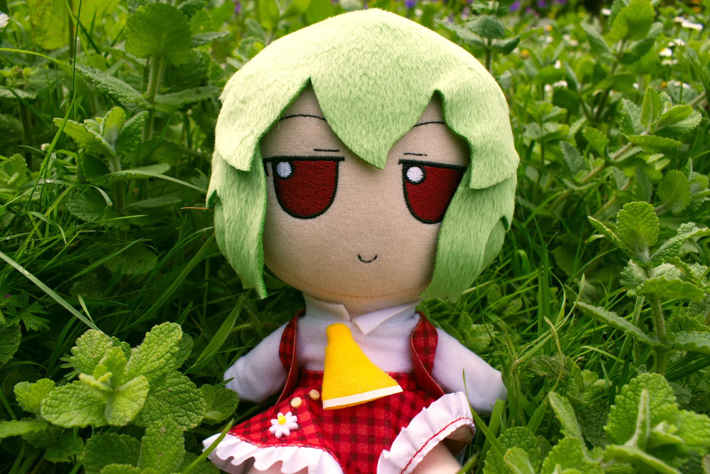
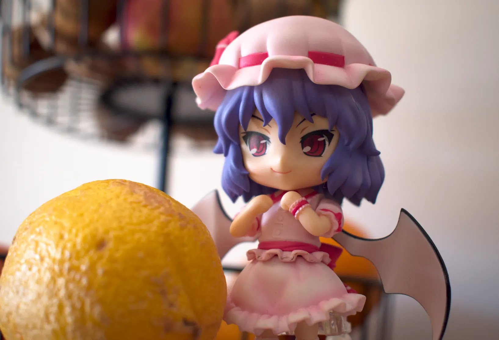
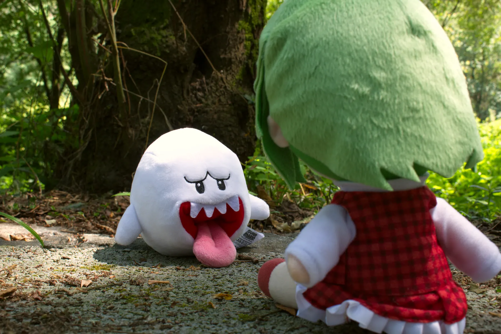
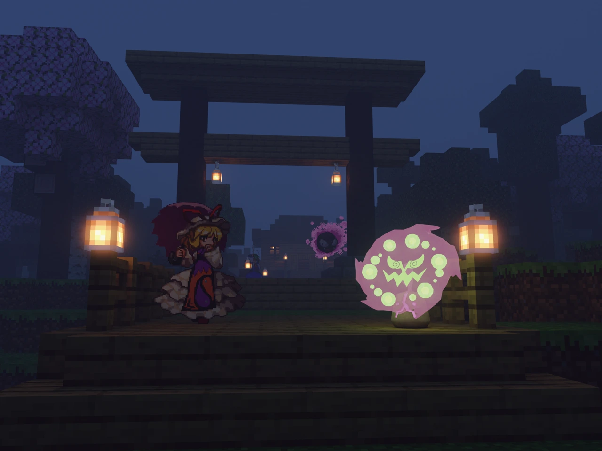
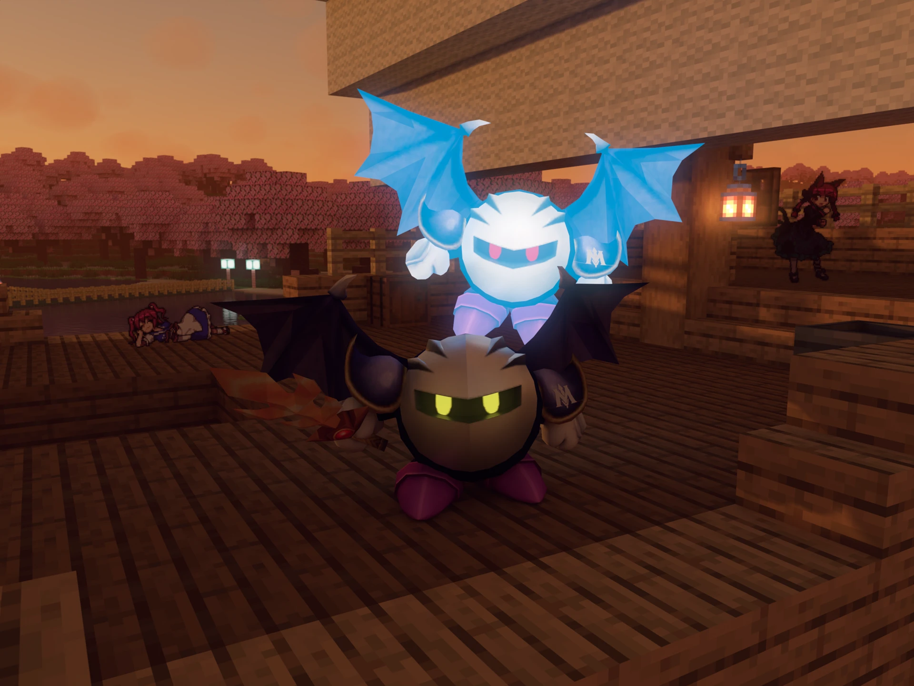

# The Forsaken Image Gallery
This repository contains many of my various image artworks

## Image Manipulation

  
  
  

## Photography

I am also a photographer. I started taking photography more seriously by 2020 and my interest increased a lot when I got myself a DSLR camera. I like toy photography the most, using plushies, figures and nendoroids exactly because it's a direct real-life equivalent of what I do with GIMP and Blender. I also like photographing plants, animals and landscapes, though I prefer if I can at least compose a plush into the scene.

I always take pictures in RAW, then I process them in Darktable.

  
  
  

## 3D image

3D images are image renders created from a 3D scene. A 3D world is less convenient to build compared to making an image on GIMP but it gives much better control over perspective, lighting, depth and other characteristics. I use Blender for my 3D images and I often place 2D sprites on my 3D worlds and sometimes use proper 3D models of characters. To create a world conveniently, I build it in Minecraft then export it as a 3D model. Alternatively, I sculpt and paint the terrain then place Minecraft buildings and trees on it.

While I use Blender now, I have used Unity and Source Filmmaker before for this purpose and I occasionally use Garry's Mod.

  
  
  

