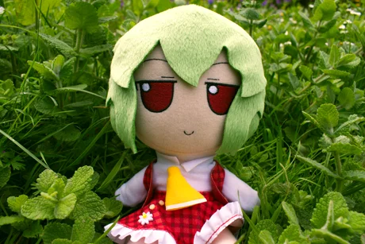
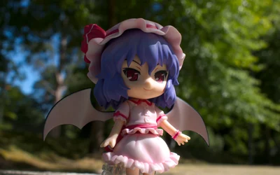
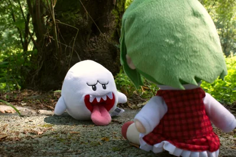
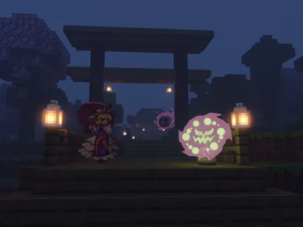

# Image Artwork Gallery
This repository contains some of my various image creations. It serves as a portfolio-like gallery to show my works.

  
  
  

  
  
  

  
  
  
  

* **[2D Image Gallery](md/2d.md)**
* **[3D Gallery (Blender)](md/blender.md)**
* **[3D Gallery (Garry's Mod)](md/gmod.md)**
* **[Photography Gallery](md/photo.md)**

### Other Links
* **[Steam Gallery](https://steamcommunity.com/id/spacebanana420/images/)**
* **[Image Artwork Overview](https://github.com/spacebanana420/spacebanana420/blob/main/md/image.md)**
* **[High Quality Image Archive](gallery/hq)**

The quality and resolution of the images here was decreased to spare on file size. Images in `thumbnail` and `web` have lower quality for viewing, while all images in `hq` are higher quality, though JPG to spare on gallery size. The original images are all in PNG, but that would be too heavy for the repo.

## License

This repository and all of its images are licensed under [CC BY-NC-SA](https://creativecommons.org/licenses/by-nc-sa/4.0/).
