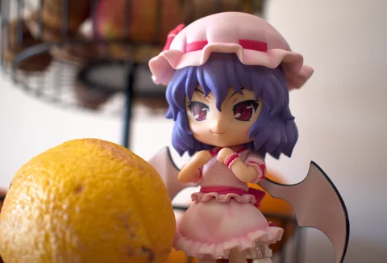

# The Forsaken Image Gallery
This repository contains some of my various image artworks, it serves as a portfolio-like gallery to show some of my creations.

* **[2D Image Gallery](md/2d.md)**
* **[3D Gallery (Blender)](md/blender.md)**
* **[Photography Gallery](md/photo.md)**

The quality and resolution was decreased to spare on file size. Images in `thumbnail` and `web` have lower quality for faster/lighter internet downloads, while all images in `hq` are higher quality, though JPG to spare on gallery size.

## Image Manipulation

  
  
  

## Photography

  
  
  

## 3D image

  
  
  

